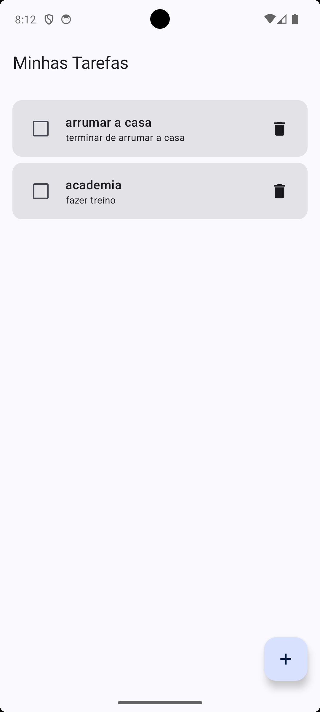
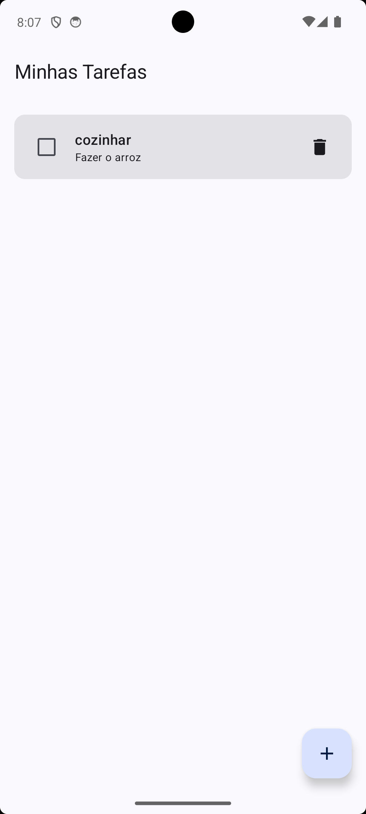
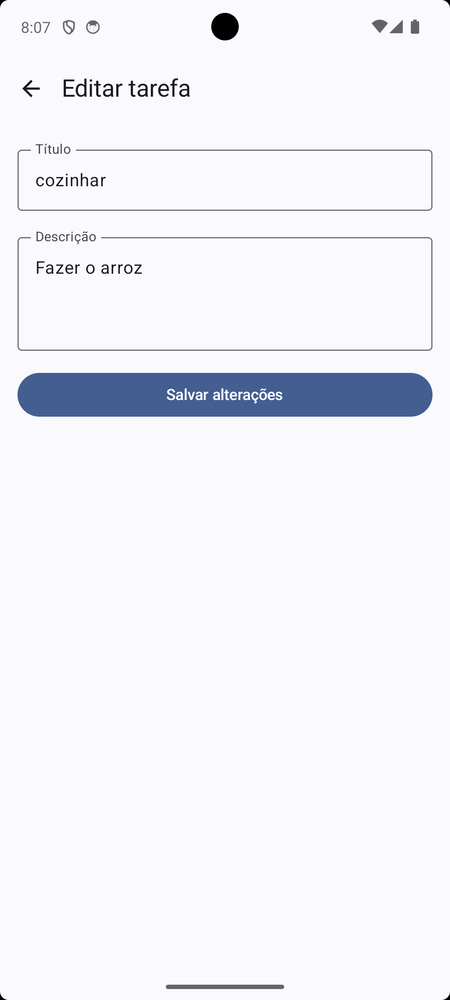
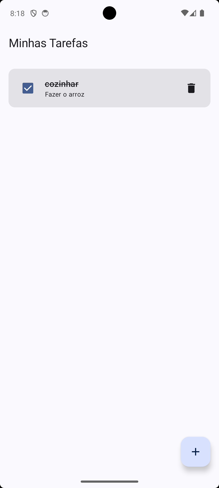
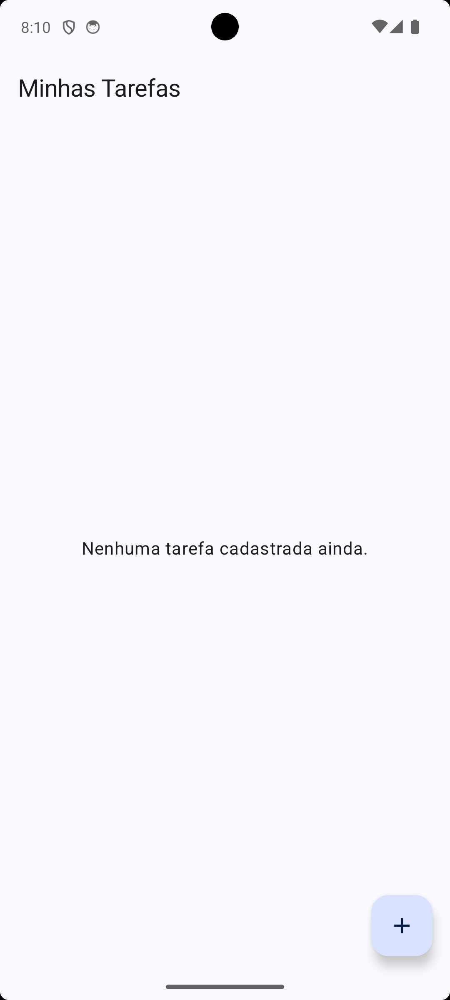
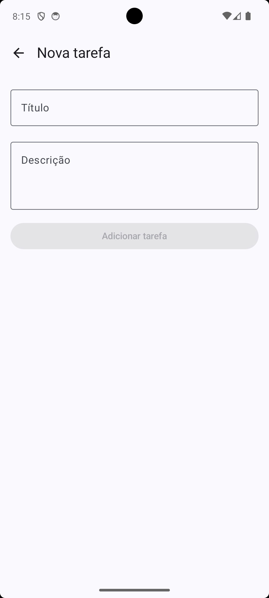
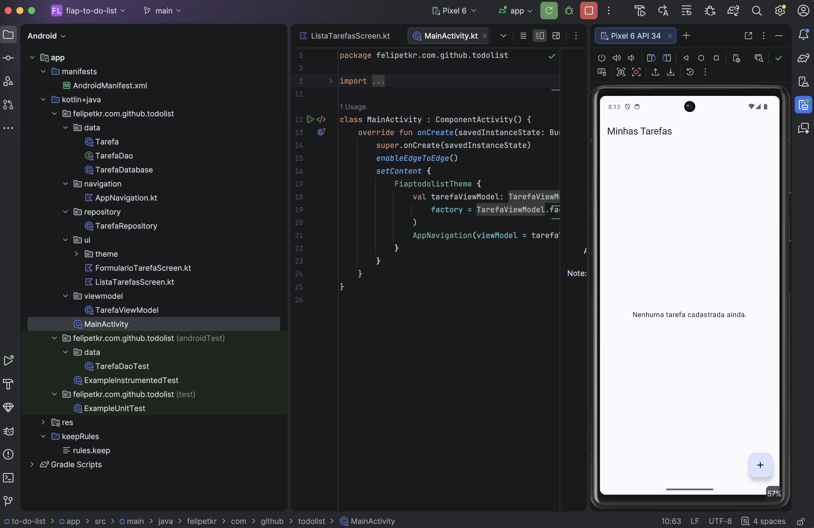

# To-Do List — Android (FIAP)

Aplicativo Android de lista de tarefas desenvolvido como atividade individual da disciplina de Sistemas de Informação da FIAP. O objetivo da atividade foi evoluir a base de projeto fornecida pelo professor (Entity, DAO e Database do Room já prontos), implementando a camada de apresentação (Repository, ViewModel, telas em Jetpack Compose e navegação) para produzir um app funcional de tarefas.

## Funcionalidades

- Listar tarefas cadastradas
- Cadastrar uma nova tarefa (título e descrição)
- Editar uma tarefa existente
- Marcar/desmarcar uma tarefa como concluída
- Excluir uma tarefa
- Navegação entre a lista e o formulário sem encerrar o app
- Persistência local dos dados via Room (SQLite) — as tarefas continuam salvas após fechar o app

## Tecnologias

| Camada | Tecnologia |
|---|---|
| Linguagem | Kotlin |
| UI | Jetpack Compose + Material 3 |
| Navegação | Navigation Compose |
| Persistência | Room (SQLite) |
| Assincronismo | Kotlin Coroutines + Flow |
| Estado da UI | ViewModel + StateFlow |

## Arquitetura (MVVM)

```
app/src/main/java/felipetkr/com/github/todolist/
├── data/          # Model — Entity (Tarefa), DAO e configuração do banco (Room)
├── repository/    # Model — TarefaRepository, abstrai o acesso a dados para a ViewModel
├── viewmodel/     # ViewModel — TarefaViewModel, estado observável e ações da UI
├── ui/            # View — ListaTarefasScreen e FormularioTarefaScreen (Jetpack Compose)
└── navigation/    # View — AppNavigation, rotas entre as telas
```

### `TarefaRepository`

Fica em `repository/TarefaRepository.kt`. É a camada que isola a `TarefaViewModel` do `TarefaDao` (Room): expõe `listarTarefas(): Flow<List<Tarefa>>` e os métodos `inserirTarefa`, `atualizarTarefa` e `excluirTarefa`, todos delegando diretamente para o DAO. A ViewModel nunca acessa o Room diretamente — sempre passa pelo Repository, o que facilita trocar a fonte de dados no futuro sem afetar a UI.

### `TarefaViewModel`

Fica em `viewmodel/TarefaViewModel.kt`. Recebe um `TarefaRepository` no construtor e expõe:

- `tarefas: StateFlow<List<Tarefa>>` — o Flow do Repository convertido em `StateFlow` via `stateIn(viewModelScope, SharingStarted.WhileSubscribed(5_000), emptyList())`, para que a UI observe a lista de forma reativa e o Flow do banco só fique ativo enquanto houver alguém coletando.
- `adicionarTarefa(Tarefa)`, `editarTarefa(Tarefa)`, `excluirTarefa(Tarefa)` — disparam as operações do Repository dentro do `viewModelScope`.
- `alternarConclusao(Tarefa)` — atalho que inverte o campo `concluida` de uma tarefa (`tarefa.copy(concluida = !tarefa.concluida)`) e chama `atualizarTarefa`, usado pelo checkbox da lista.

A instância é criada por uma **Factory** (`TarefaViewModel.factory(context)`), usando o DSL `viewModelFactory { initializer { ... } }` do `androidx.lifecycle.viewmodel`, que monta o `TarefaDatabase`, o `TarefaDao` e o `TarefaRepository` sob demanda.

### `ListaTarefasScreen`

Fica em `ui/ListaTarefasScreen.kt`. `ListaTarefasScreen` coleta `viewModel.tarefas` com `collectAsStateWithLifecycle()` (só recompõe enquanto a tela está visível) e repassa a lista para `ListaTarefasConteudo`, um composable *stateless* que só recebe dados e lambdas — isso separa a parte "conectada à ViewModel" da parte "só desenha a UI", facilitando os `@Preview`. Cada item é desenhado por `CartaoTarefa`, que dispara:

- `aoAlternarConclusao` → `viewModel.alternarConclusao(tarefa)` (checkbox)
- `aoAbrir` → navega para o formulário passando o `id` da tarefa (clique no card)
- `aoExcluir` → `viewModel.excluirTarefa(tarefa)` (ícone de lixeira)

O botão flutuante (FAB) dispara `aoCriarTarefa`, que navega para o formulário com id `0` (nova tarefa).

### `FormularioTarefaScreen`

Fica em `ui/FormularioTarefaScreen.kt`. Recebe um `tarefaId: Int` vindo da navegação. Se `tarefaId == 0` (constante `ID_NOVA_TAREFA`), é modo cadastro: os campos começam vazios e, ao salvar, chama `viewModel.adicionarTarefa(...)`. Se `tarefaId` corresponder a uma tarefa existente na lista observada da ViewModel, é modo edição: os campos de título/descrição são pré-preenchidos com os dados da tarefa encontrada e, ao salvar, chama `viewModel.editarTarefa(...)` com uma cópia atualizada da tarefa original (preservando `id` e `concluida`). Em ambos os casos, o botão "Voltar" e o próprio salvar retornam à tela anterior.

### `AppNavigation`

Fica em `navigation/AppNavigation.kt`. Define um `NavHost` com duas rotas:

- `"lista"` — tela inicial, exibe `ListaTarefasScreen`.
- `"formulario/{tarefaId}"` — exibe `FormularioTarefaScreen`, com `tarefaId` declarado como argumento tipado (`navArgument(ARG_TAREFA_ID) { type = NavType.IntType }`), lido via `backStackEntry.arguments?.getInt(ARG_TAREFA_ID)`.

A navegação para nova tarefa usa `formulario/0`; para editar, `formulario/{id da tarefa}`. Voltar usa `navController.popBackStack()`.

### `MainActivity`

Cria a `TarefaViewModel` com `viewModel(factory = TarefaViewModel.factory(applicationContext))` (API `androidx.lifecycle.viewmodel.compose.viewModel`) dentro do `setContent { }`, e inicia o app chamando `AppNavigation(viewModel = tarefaViewModel)`. O conteúdo de exemplo gerado pelo template do Android Studio ("Hello Android") foi removido.

## Pré-requisitos

- [Android Studio](https://developer.android.com/studio) (Ladybug ou mais recente)
- JDK 11+
- Emulador Android (API 24+) ou dispositivo físico

## Como executar

1. Clone o repositório:
   ```bash
   git clone https://github.com/felipetkr/Trabalho-kotlin-.git
   ```
2. Abra a pasta do projeto no Android Studio e aguarde a sincronização do Gradle.
3. Selecione um emulador (API 24+) ou conecte um dispositivo físico.
4. Clique em **Run** ▶ ou execute pelo terminal:
   ```bash
   ./gradlew installDebug
   ```

## Testes

```bash
# Testes unitários (JVM)
./gradlew test

# Testes instrumentados (requer emulador/dispositivo conectado)
./gradlew connectedAndroidTest
```

## Evidências

Screenshots do app em execução, demonstrando cada fluxo pedido na atividade:

| Fluxo | Print |
|---|---|
| Tela inicial com a lista de tarefas |  |
| Cadastro de uma nova tarefa |  |
| Tarefa cadastrada aparecendo na lista |  |
| Edição de uma tarefa existente |  |
| Tarefa marcada como concluída |  |
| Exclusão de uma tarefa |  |
| Navegação entre lista e formulário |  |
| Build/execução do projeto sem erros |  |

As imagens ficam em [`docs/evidencias`](docs/evidencias). Para aparecerem aqui, os arquivos precisam existir com esse nome exato na pasta e estar commitados/enviados ao GitHub (veja abaixo como gerar e adicionar os prints).

## Autor

Felipe Takara
